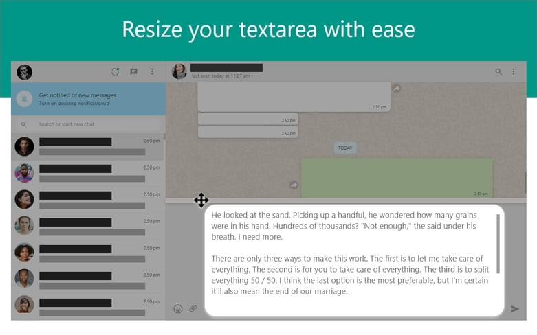

Greasemonkey script to allow whatsapp chatbox resize

# Objective
Useful when you are typing long passage and would like to see more what you have typed

## Install
First install the browser plugin
- [Chrome Plugin](https://chrome.google.com/webstore/detail/tampermonkey/dhdgffkkebhmkfjojejmpbldmpobfkfo)
- [Firefox Add-on](https://addons.mozilla.org/en-US/firefox/addon/tampermonkey/)

Then install the script from greasyfork
[whatsapp-textarea-resize](https://greasyfork.org/en/scripts/427888-whatsapp-textarea-resize)